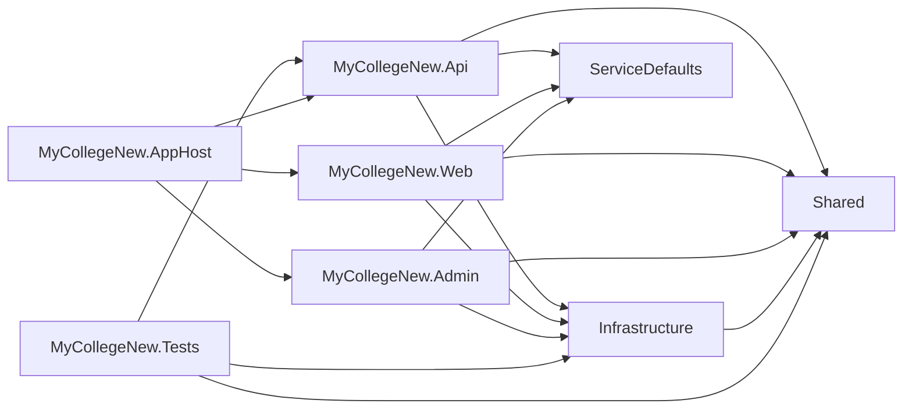
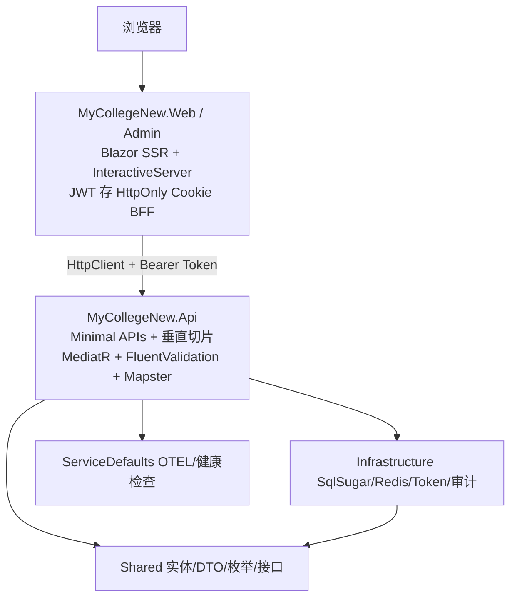

# 校园考勤管理系统 · 开发说明

面向二次开发与维护者。汇总项目目标、解决方案结构、构建运行、配置要点、架构、测试、安全设计与演进脉络。

---

## 文档索引

| 文档 | 受众 | 说明 |
|------|------|------|
| [用户使用说明](用户使用说明.md) | 最终用户 | 功能与操作，无技术细节 |
| [README](../README.md) | 访客 | 项目入口与快速开始 |
| `需求分析.docx` / `需求分析.md` | 开发者 | 原始需求（位于本目录） |
| `superpowers/` | 开发者 | UI 重设计与考勤增强设计规格（位于本目录） |

---

## 1. 项目目标与范围

基于 **.NET 10 + ASP.NET Core 10** 的校园考勤管理系统，采用 **垂直切片架构 (VSA) + CQRS + Minimal APIs**，支持管理员、教师（任课教师 / 辅导员）、学生三端。覆盖组织架构、师生管理、课程排课、考勤签到、请假审批、统计报表等业务，并提供 JWT + HttpOnly Cookie (BFF) 认证、2FA、审计日志等安全能力。

---

## 2. 解决方案结构

解决方案文件位于仓库根：`MyCollegeNew.sln`。所有业务与测试工程位于 `src/`。

```text
my-college-project/
├── MyCollegeNew.sln
├── README.md
├── Directory.Build.props          # 根级编译属性（非 src 工程继承）
├── docker-compose.yml             # 标准部署
├── docker-compose.cpolar.yml      # cpolar 公网隧道部署
├── .env.cpolar.example
├── docs/                          # 文档（本文件所在）
├── src/
│   ├── Directory.Build.props      # src 统一 TFM / Nullable / RootNamespace
│   ├── MyCollegeNew.Shared/       # 共享内核：实体 / DTO / 枚举 / 异常 / 常量 / 接口
│   ├── MyCollegeNew.Infrastructure/  # 基础设施：SqlSugar / Token / 用户上下文 / 审计 / 调度
│   ├── MyCollegeNew.ServiceDefaults/ # Aspire 服务默认：OTEL / 健康检查 / 服务发现 / 弹性
│   ├── MyCollegeNew.Api/          # API 入口：Minimal APIs + 垂直切片
│   ├── MyCollegeNew.Web/          # Blazor Web App（教师 / 学生端）
│   ├── MyCollegeNew.Admin/        # Blazor Web App（管理员后台，UI 重设计拆分）
│   ├── MyCollegeNew.AppHost/      # .NET Aspire 编排器
│   └── MyCollegeNew.Tests/        # xUnit 单元测试
```

### 项目依赖关系



### 默认命名空间

统一在 `src/Directory.Build.props` 设置：

```xml
<RootNamespace>Larpx.PersonalTools.$(MSBuildProjectName)</RootNamespace>
```

即各工程默认命名空间为 `Larpx.PersonalTools.MyCollegeNew.{Layer}`，根前缀固定为 `Larpx.PersonalTools.`。

---

## 3. 环境 / 构建 / 运行

### 环境要求

| 工具 | 版本 | 说明 |
|------|------|------|
| .NET SDK | 10.0 | 必需 |
| MySQL | 8.0+ | 仅 Release 模式；开发默认用 SQLite |
| Docker | 24.0+ | 仅 Docker 部署时需要 |

### 构建与运行

```bash
# 还原与构建（解决方案位于仓库根）
dotnet restore MyCollegeNew.sln
dotnet build MyCollegeNew.sln

# 运行 API
dotnet run --project src/MyCollegeNew.Api

# 运行 Web（教师 / 学生端）
dotnet run --project src/MyCollegeNew.Web

# 运行 Admin（管理员后台）
dotnet run --project src/MyCollegeNew.Admin

# 运行测试
dotnet test src/MyCollegeNew.Tests

# Aspire 本地编排（一次性拉起 Api / Web / Admin / Redis）
dotnet run --project src/MyCollegeNew.AppHost
```

### 开发端口

| 项目 | HTTP | HTTPS |
|------|------|-------|
| Api | `http://localhost:5144` | `https://localhost:7088` |
| Web | `http://localhost:5249` | `https://localhost:7250` |
| AppHost | `http://localhost:15096` | `https://localhost:17179` |

> 开发环境默认使用 SQLite，数据库文件 `attendance.db` 自动创建。

### 开发环境配置（user-secrets）

`appsettings.json` 中 `Db:ConnectionString`、`appsettings.Development.json` 中 `Jwt:SecretKey` 与 `Cors:AllowedOrigins` 均已置空，启动时强制校验非空。本地开发用 `dotnet user-secrets` 管理：

```bash
# 配置 API
cd src/MyCollegeNew.Api
dotnet user-secrets set "Db:ProviderType" "SQLite"
dotnet user-secrets set "Db:ConnectionString" "DataSource=attendance.db"
dotnet user-secrets set "Jwt:SecretKey" "<至少 32 字符的随机字符串>"
dotnet user-secrets set "Cors:AllowedOrigins:0" "https://localhost:7088"

# 配置 Web（JWT 密钥需与 API 一致）
cd ../MyCollegeNew.Web
dotnet user-secrets set "Jwt:SecretKey" "<与 API 一致的随机字符串>"
dotnet user-secrets set "Cors:AllowedOrigins:0" "https://localhost:7250"
```

> DEBUG 模式下若未配置 `Jwt:SecretKey`，将自动生成临时随机密钥，仅用于本地调试，切勿用于生产。

---

## 4. 架构与数据流

### 垂直切片架构 (VSA)

按业务功能切分代码，每个功能模块内含自身的 Endpoint、Handler、Command/Query、DTO、Validator。切片间禁止直接引用内部 Handler，跨功能调用通过 MediatR 发送请求。



### 切片内文件结构

```text
Features/{Feature}/
├── {Action}Endpoint.cs      # Minimal API 路由注册
├── {Action}Command.cs       # CQRS 请求（Command / Query）
├── {Action}Handler.cs       # 业务逻辑
└── {Action}Validator.cs     # FluentValidation 校验
```

### 请求处理流程

1. 浏览器点击操作 → Blazor Server 渲染。
2. `ApiClient` 从 HttpOnly Cookie 读取 JWT，附加 `Authorization: Bearer` 请求后端。
3. `JwtBearer` 中间件验证 Token（含黑名单检查），角色策略校验后通过 `IMediator` 发送 Query/Command。
4. `ValidationBehavior` 自动校验 → Handler 执行业务逻辑 → SqlSugar 操作数据库。
5. Mapster 映射 DTO → Endpoint 返回 `Results.Ok(dto)` → ApiClient 反序列化 → Blazor 渲染。

### 关键设计点

- **ApiClient 统一封装**：自动从 Cookie 读取 Token、附加请求头、处理 401/403。
- **MediatR 管道**：ValidationBehavior 自动校验 → Handler 执行。
- **Mapster 映射**：编译时生成，Entity ↔ DTO 零反射。
- **统一响应**：所有 API 返回 `ApiResponse<T>`（Code + Message + Data）；异常返回 ProblemDetails (RFC 7807)。

### 数据库切换

通过 `Db:ProviderType` 在 SQLite 与 MySQL 间切换：

| 环境 | ProviderType | 说明 |
|------|-------------|------|
| Development | SQLite | 零配置，`attendance.db` 自动创建 |
| Production | MySQL | 通过环境变量 `Db__ConnectionString` 注入 |

SqlSugar CodeFirst 自动建表，启动时由 `DbInitializer.InitializeAsync()` 执行，无需手动迁移。

### 关键数据模型

| 实体 | 关键字段 | 说明 |
|------|----------|------|
| `SystemUser` | Id, Username, PasswordHash, Role | 管理员账号 |
| `Teacher` | Id, Username, PasswordHash | 教师 / 辅导员账号 |
| `Student` | Id, StudentNo, PasswordHash, MustChangePassword | 学生账号；`MustChangePassword` 标记 CSV 导入随机密码账号需首登强制改密 |
| `AuditLog` | Id, UserId, Action, Target, IpAddress, UserAgent, CreatedAt, Extra | 审计日志，由 `IAuditService` 写入 |

---

## 5. 认证流程（BFF 模式）

### 登录流程

1. 客户端调用 `/api/v1/auth/login`，请求体必须包含 `CaptchaToken`（滑块验证码）。
2. `LoginValidator` 强制校验 `CaptchaToken` 非空，`LoginHandler` 再次校验 token 有效性。
3. 用户不存在时执行 dummy BCrypt Verify，消除时序侧信道。
4. 密码校验通过后签发 JWT（Claims 含 `NameIdentifier`、`Name`、`Role`、`user_id`、`system_user_id`、`jti`，过期 120 分钟）。
5. 服务端将 JWT 写入 HttpOnly Cookie（`campus_attendance_token`，Secure + SameSite=Strict）。
6. 若学生 `MustChangePassword = true`，返回 `mustChangePassword`，客户端跳转 `/force-change-password`。
7. 若启用 2FA，返回 `requiresTwoFactor`，走 2FA 验证流程。

### JWT 撤销

登出端点 `/api/v1/auth/logout` 调用 `TokenRevocationService.RevokeAsync(jti, expiry)`，将 `jti` 写入 `IDistributedCache`（TTL = token 剩余有效期）。`OnTokenValidated` 事件实时检查黑名单，命中则 401。依赖 Redis / `IDistributedCache`，生产必须配置。

### 2FA（TOTP）

- **启用**：`/api/v1/auth/2fa-setup` 生成 TOTP 密钥与二维码，密钥经 `IDistributedCache` 服务端会话存储（不再通过非 HttpOnly Cookie 下发）。
- **验证**：`/api/v1/auth/2fa-verify` 校验验证码，已用验证码写入 `IDistributedCache`，30s 内拒绝重放；独立速率限制每 IP 每分钟 10 次，5 次失败锁定。
- 已删除死端点 `/auth/2fa-complete`（避免未验证即创建会话的风险）。

---

## 6. 安全设计

系统已通过两轮安全审计，第二轮共修复 17 个漏洞（5 HIGH / 7 MEDIUM / 5 LOW）。

| 安全措施 | 实现方式 |
|----------|----------|
| 密码存储 | BCrypt 哈希 + 自动盐值 |
| 密码策略 | `ApplyPasswordPolicy()` FluentValidation 扩展，至少 8 位、含大小写字母和数字 |
| 学生默认密码 | CSV 批量导入用 `RandomNumberGenerator` 生成 12 位随机密码 + `MustChangePassword` 标记 |
| JWT 认证 | HMACSHA256 签名，ClockSkew 1 分钟，Claims 含 `system_user_id` 与 `jti` |
| JWT 撤销 | `TokenRevocationService` + `/auth/logout` + `OnTokenValidated` 黑名单检查 |
| BFF 模式 | JWT 存 HttpOnly Cookie，禁止 JS 访问 |
| 登录验证码 | `CaptchaToken` 必填，Validator + Handler 强制校验 |
| 时序侧信道 | 用户不存在时执行 dummy BCrypt Verify |
| 2FA 重放保护 | TOTP 已用验证码写入 `IDistributedCache`，30s 内拒绝重放 |
| 2FA 速率限制 | 独立限流：每 IP 每分钟 10 次 + 5 次失败锁定 |
| 2FA 密钥存储 | TOTP 密钥 / 二维码改用 `IDistributedCache` 服务端会话存储 |
| 审计日志 | `IAuditService` 记录登录成败、密码修改/重置、2FA、用户增删、批量导入等 |
| CSV 异常脱敏 | 批量导入异常不返回 `ex.Message` 给客户端 |
| 安全响应头 | `SecurityHeadersMiddleware` 输出 CSP / HSTS / X-Content-Type-Options / X-Frame-Options / Referrer-Policy / Permissions-Policy |
| CORS 白名单 | `Cors:AllowedOrigins` 置空，仅允许显式配置来源，禁止 `AllowAnyOrigin` |
| 配置安全 | `appsettings.json` 数据库连接串置空、`appsettings.Development.json` JWT SecretKey 置空，启动校验；开发用 user-secrets |
| 异常处理 | 系统异常返回 ProblemDetails (RFC 7807)，不暴露内部细节 |
| 角色授权 | RequireAdmin / RequireTeacher / RequireStudent / RequireCounselor |
| 限流 | System.Threading.RateLimiting 固定窗口限流 |

### 中间件管道

```text
HttpsRedirection → HSTS
→ SecurityHeadersMiddleware（CSP / X-Frame-Options / Referrer-Policy / Permissions-Policy）
→ CORS（白名单）
→ RateLimiter（全局 + 2FA 独立策略）
→ JwtBearer 认证（OnTokenValidated → TokenRevocationService 黑名单校验）
→ Routing → Endpoint → MediatR 管道（ValidationBehavior → Handler，可注入 IAuditService）
→ IAuditService 记录敏感操作 → AuditLog 表
```

---

## 7. 测试与覆盖约定

测试工程 `src/MyCollegeNew.Tests/`，基于 xUnit，覆盖 API Features 各切片 Handler 业务逻辑。

- **框架**：xUnit + Moq + coverlet
- **模式**：AAA（Arrange-Act-Assert）
- **命名**：`Method_Scenario_ExpectedResult`
- **隔离**：内存 SQLite（`TestDbContext`），启动时 CodeFirst 建表

### 测试基础设施

| 类型 | 说明 |
|------|------|
| `TestDbContext` | 内存 SQLite 上下文；`student` 表含 `MustChangePassword` 列，`audit_log` 表供审计写入 |
| `TestCurrentUser` | 实现 `ICurrentUser`，含 `SystemUserId`（对应 JWT `system_user_id` claim） |
| `NullAuditService` | `IAuditService` 空实现，测试默认注入避免审计写入干扰断言；需断言审计时换 `Mock<IAuditService>` |
| `TestDistributedCache` | 内存字典实现 `IDistributedCache`，支撑 TOTP 重放保护 / JWT 黑名单 / 2FA 密钥会话测试 |

### 测试覆盖

| 测试类 | 覆盖功能 |
|--------|----------|
| `AuthServiceTests` | 登录认证（验证码校验、强制改密、时序侧信道） |
| `AttendanceServiceTests` | 考勤会话 / 签到 / 点名 |
| `LeaveServiceTests` | 请假申请 / 审批 |
| `CourseServiceTests` | 课程管理 |
| `ScheduleServiceTests` | 排课管理 |
| `OrganizationServiceTests` | 组织架构 |
| `UserServiceTests` | 用户管理（CSV 导入随机密码、异常脱敏） |
| `StatisticsServiceTests` | 考勤统计 |
| `Extensions` | 扩展方法 / 枚举（含 `ApplyPasswordPolicy`） |

### 运行测试

```bash
dotnet test src/MyCollegeNew.Tests
# 带覆盖率
dotnet test src/MyCollegeNew.Tests --collect:"XPlat Code Coverage"
```

### 安全审计相关测试要点

- 登录成功用例必须预置有效 captcha token；缺失 / 无效 token 用例断言 400。
- `TestCurrentUser` 构造时设置 `SystemUserId`，验证 `ChangePasswordHandler` Admin 分支按 Id/Username 正确查询。
- `MustChangePassword = true` 的学生登录后应触发改密流程。
- 同一 TOTP 验证码二次提交应被拒绝。
- `TokenRevocationService.RevokeAsync` 后 `IsRevokedAsync(jti)` 返回 true。
- 敏感操作后用 `Mock<IAuditService>.Verify` 验证 `LogAsync` 被调用。

---

## 8. 部署

### Docker 标准部署

容器编排含四个服务：

| 服务 | 镜像 | 端口 | 说明 |
|------|------|------|------|
| `redis` | redis:7-alpine | 6379（不映射） | 分布式缓存（JWT 黑名单 / TOTP 重放 / 2FA 锁定依赖） |
| `db` | mysql:8.0 | 3306（不映射） | MySQL，数据持久化至命名卷 |
| `api` | 自建 .NET 10 | 5000 → 8080 | Minimal APIs 后端 |
| `web` | 自建 .NET 10 | 8080 → 8080 | Blazor Web App 前端 |

启动顺序：`db`（健康检查通过）→ `redis` → `api`（健康检查通过）→ `web`。

```bash
git clone <仓库地址>
cd my-college-project
docker-compose up -d --build
docker-compose ps
docker-compose logs -f
```

启动后访问 http://localhost:8080。

### 必需环境变量（生产强制）

`appsettings.json` 中 `Db__ConnectionString`、`Jwt__SecretKey`、`Cors__AllowedOrigins` 均已置空，必须通过环境变量注入，否则启动校验失败。

| 变量 | 说明 |
|------|------|
| `Db__ProviderType` | 数据库类型（SQLite / MySQL） |
| `Db__ConnectionString` | 数据库连接字符串（必须注入） |
| `Jwt__SecretKey` | JWT 签名密钥，≥32 字符（必须注入） |
| `Cors__AllowedOrigins__0` | CORS 白名单来源，禁止 `*`（必须注入） |
| `ForwardedHeaders__Enabled` | 反向代理场景必须设 `true` |
| `ASPNETCORE_ALLOWEDHOSTS` | 允许的 Host 头，禁止 `*` |
| `ConnectionStrings__redis` | Redis 连接（JWT 黑名单 / TOTP 重放 / 2FA 锁定依赖） |

在根目录创建 `.env` 文件（切勿提交）由 docker-compose 自动加载。

### cpolar 公网隧道部署

适用内网服务器 + cpolar 隧道 + 公网 HTTPS。`docker-compose.cpolar.yml` 相比标准部署的差异：数据库用最小权限 `app_user`、API/DB/Redis 端口均不映射、启用 `ForwardedHeaders`、`AllowedHosts` 与 CORS 设为 cpolar 域名、自定义 `app_network` 网络隔离。

```bash
cp .env.cpolar.example .env.cpolar
# 编辑 .env.cpolar 填入 JWT_SECRET_KEY / CPOLAR_DOMAIN / CORS_ALLOWED_ORIGINS / DB 连接串等
docker compose -f docker-compose.cpolar.yml --env-file .env.cpolar up -d --build
```

> `.env.cpolar` 含敏感凭据，`.gitignore` 已排除。

### 学生 CSV 批量导入流程

1. 管理员上传 CSV 至 `/api/v1/users/students/batch-import`。
2. 系统为每人生成 12 位随机密码，`MustChangePassword = true`。
3. 响应返回 `GeneratedPasswords`（学号 → 密码清单，仅管理员可见，需安全渠道下发）。
4. 学生首登后跳转 `/force-change-password` 强制改密，成功后标记置 `false`。
5. 导入异常响应不暴露 `ex.Message`，仅返回通用错误。

---

## 9. 配置要点与护栏

- **启动校验**：`Db:ConnectionString`、`Jwt:SecretKey`、`Cors:AllowedOrigins` 启动时强制非空，缺失抛异常阻止启动。
- **密码策略**：所有涉及密码的 Validator 必须调用 `ApplyPasswordPolicy()`，禁止手写正则。
- **审计**：敏感操作必须通过 `IAuditService` 记录（登录成败、密码修改/重置、2FA、用户增删、批量导入）。
- **CORS**：禁止 `AllowAnyOrigin`，必须白名单。
- **JWT 撤销**：登出必须调用 `TokenRevocationService`，禁止仅清 Cookie。
- **2FA 密钥**：必须经 `IDistributedCache` 服务端会话，禁止非 HttpOnly Cookie 传输。
- **异常脱敏**：面向客户端响应禁止包含 `ex.Message`、堆栈、内部字段名。
- **安全响应头**：由 `SecurityHeadersMiddleware` 统一注入，禁止在控制器重复设置或覆盖。

---

## 10. UI 与扩展入口

### 添加新功能切片

1. 在 `src/MyCollegeNew.Api/Features/{Feature}/` 下创建子目录。
2. 创建 `{Action}Endpoint.cs`（路由注册）、`{Action}Command.cs`（CQRS 请求）、`{Action}Handler.cs`（业务逻辑）、`{Action}Validator.cs`（校验）。
3. 在 `src/MyCollegeNew.Shared/Features/{Feature}/` 下创建 DTO。
4. 在 `Features/Endpoints.cs` 中注册路由模块。
5. 编写对应单元测试。

### UI 工程

- `MyCollegeNew.Web`：教师 / 学生端 Blazor，页面在 `Components/Pages/Teacher/` 与 `Components/Pages/Student/`。
- `MyCollegeNew.Admin`：管理员后台 Blazor，页面在 `Components/Pages/Admin/`。
- 通用 UI 组件库在各自 `Components/Ui/`（Button / Card / Modal / Table 等）。
- 渲染模式：默认静态 SSR，需交互的组件加 `@rendermode InteractiveServer`。

### 代码规范

- 命名：类 / 方法 PascalCase，参数 / 变量 camelCase，私有字段 `_camelCase`，接口 `I` 前缀。
- 异步：公共方法异步优先，Handler 与 Endpoint 接收 `CancellationToken`。
- DI：构造函数注入，配置用 `IOptions<T>`。
- 时间：统一 `DateTime.UtcNow`。
- 异常：业务异常用 `BusinessException`，系统异常返回 ProblemDetails。
- 日志：`ILogger<T>` 结构化日志。

### 提交规范

```
feat: 新增功能
fix: 修复缺陷
refactor: 重构代码
docs: 文档更新
test: 测试相关
chore: 构建/工具变更
```

---

## 11. 整改 / 演进脉络

- **初版**：垂直切片架构搭建，完成组织架构、师生管理、课程排课、考勤签到、请假审批、统计报表核心业务。
- **UI 重设计**（见 `docs/superpowers/plans/2026-06-25-ui-redesign-admin-split.md`）：将管理员后台从 `Web` 拆分为独立 `MyCollegeNew.Admin` 工程，三端 UI 分离。
- **考勤与排课增强**（见 `docs/superpowers/specs/2026-06-29-attendance-and-scheduling-enhancement-design.md`）：新增排课覆盖显示、调班 SLA 过期、院系报表等。
- **第一轮安全审计**：基础安全加固（见原 `security-audit-round-1.md`，已并入本说明安全章节）。
- **第二轮安全审计**：修复 17 个漏洞（5 HIGH / 7 MEDIUM / 5 LOW），含验证码强制校验、JWT 黑名单、2FA 重放保护与速率限制、密码策略、CSV 随机密码、审计日志、安全响应头、CORS 白名单、配置置空等。
- **部署加固**：cpolar 公网隧道部署配置修正（环境变量、健康检查、默认安全设置），Cookie 安全配置与忽略项修正。

---

## 12. 目录约定简述

| 目录 | 放什么 | 不放什么 |
|------|--------|----------|
| `src/` | 全部业务与测试工程 | 文档、脚本、模型、杂项 |
| `docs/` | 用户 / 开发 / 算法等 Markdown 文档 | 代码、脚本、构建产物 |
| `scripts/` | `.py` / `.ps1` / `.sh` 等运维与工具脚本（本项目当前无） | 业务 C# 工程、长期文档 |
| `Models/` | ONNX 等推理模型（本项目当前无） | 源码、文档 |
| `other/` | 未归类的杂项（本项目当前无） | 可归入 src/docs/scripts/Models 的内容 |

---

## 13. 开发侧 FAQ

| 问题 | 解答 |
|------|------|
| 启动报「配置项 Db:ConnectionString / Jwt:SecretKey / Cors:AllowedOrigins 为空」 | 未注入必需环境变量；本地用 user-secrets，生产用环境变量，确认 `Jwt__SecretKey` ≥32 字符、CORS 非 `*` |
| cpolar 部署登录后 Cookie 无法保存 | 确认 `ForwardedHeaders__Enabled=true`（API 与 Web 都要）、`ASPNETCORE_ALLOWEDHOSTS` 为 cpolar 域名、隧道正确转发 `X-Forwarded-Proto` |
| JWT 黑名单 / 2FA 异常 | 确认 Redis 健康、`ConnectionStrings__redis` 已注入；Redis 不可用时登出 / TOTP 重放保护 / 2FA 锁定失效 |
| 数据库连接失败 | 确认 `db` 容器健康、连接串 `Server=db` 与服务名一致、`Db__ConnectionString` 已注入 |
| Web 无法访问 API | 确认 `api` 健康、`Api__BaseUrl=http://api:8080`、`Cors__AllowedOrigins__0` 包含 Web 实际访问来源 |
| 修改代码后重新构建 | `docker-compose up -d --build api web` |
| 完全清理（含数据） | `docker-compose down -v` 后 `docker-compose build --no-cache` 再 `up -d` |

---

## 文档索引

| 文档 | 说明 |
|------|------|
| [用户使用说明](用户使用说明.md) | 面向最终用户 |
| [README](../README.md) | 项目入口 |
| `需求分析.docx` / `需求分析.md` | 原始需求 |
| `superpowers/` | UI 重设计与考勤增强设计规格 |
